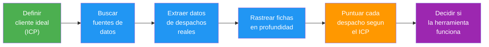
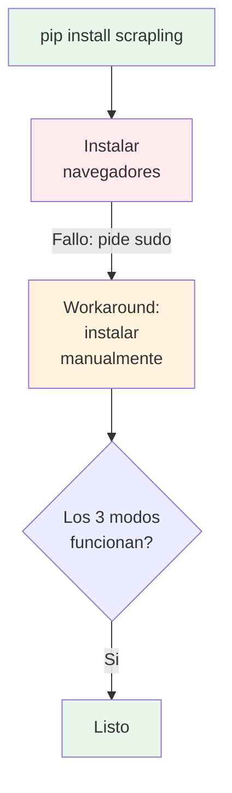
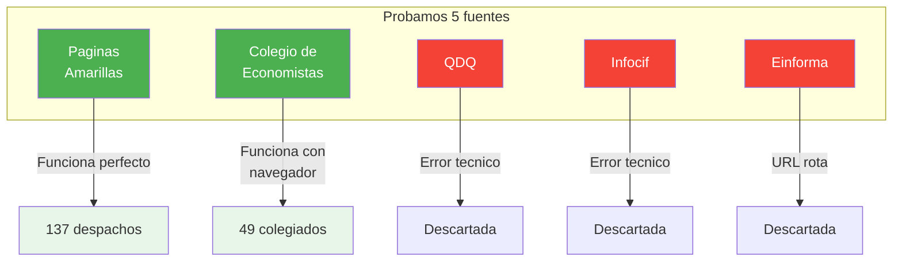
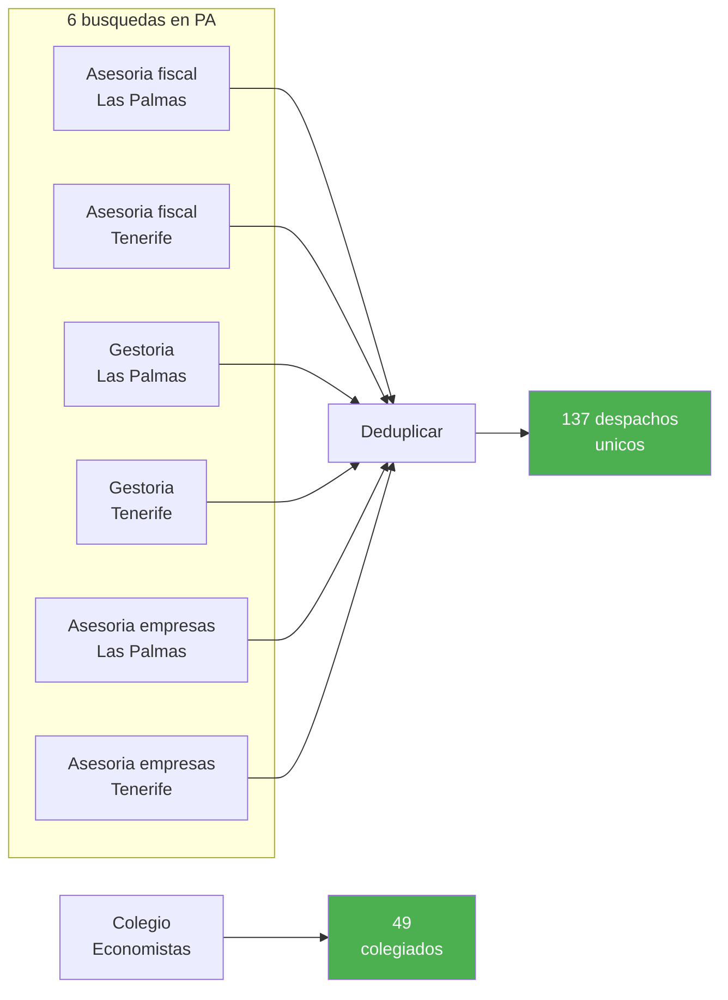
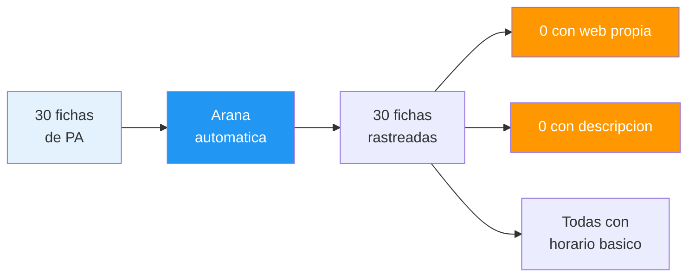
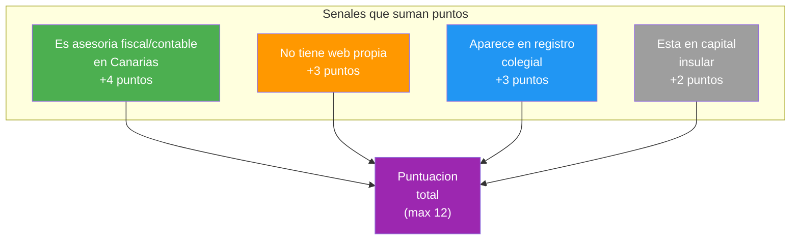
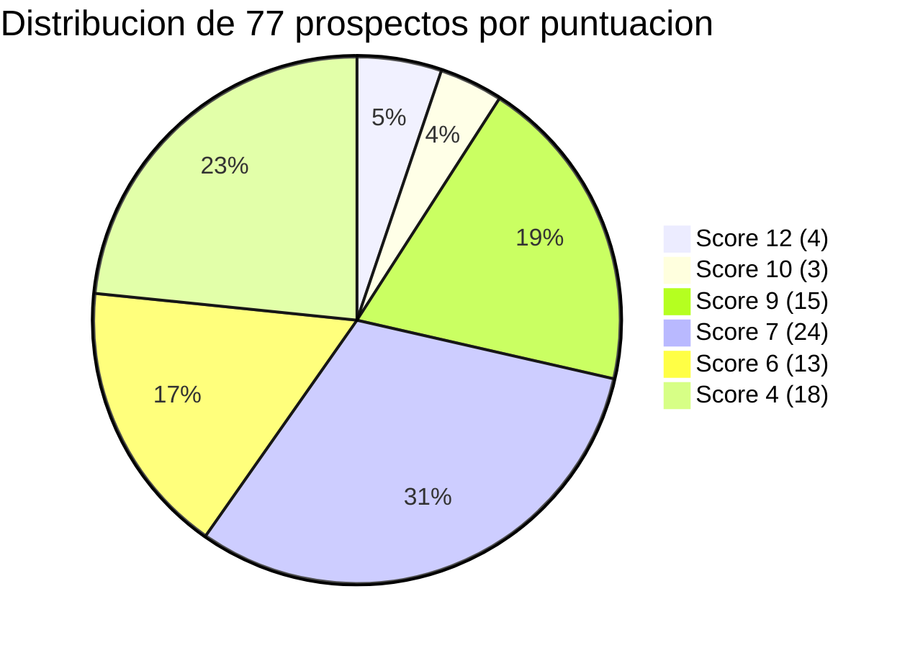
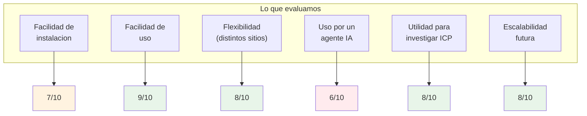
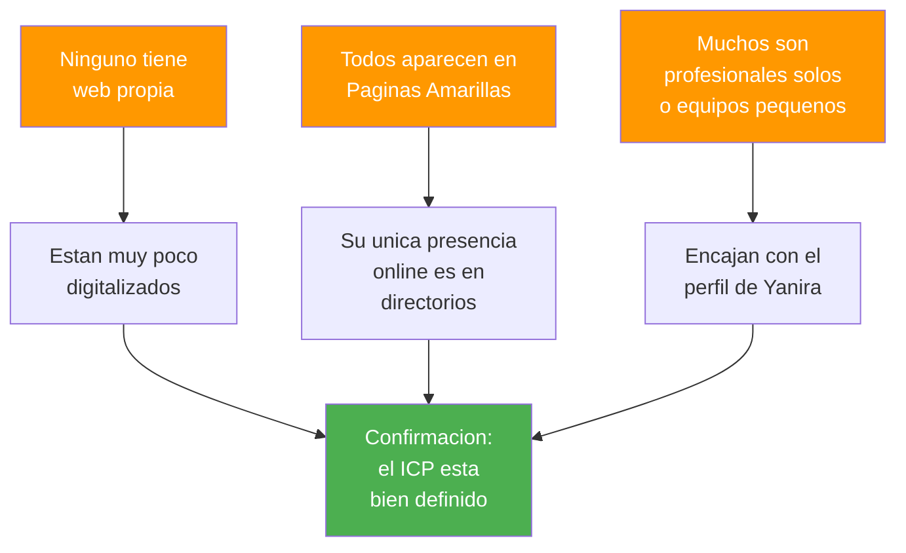
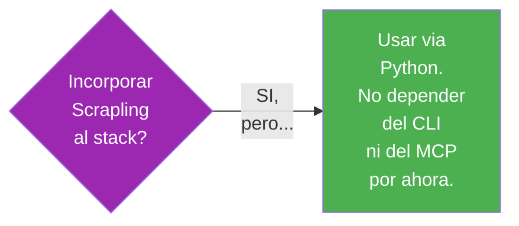

# Que hicimos, como y que descubrimos

> Guia visual del Experimento 0 para tomar decisiones sin necesidad de leer codigo.

---

## La idea en 30 segundos

Queríamos responder una pregunta:

> **Puede una herramienta de scraping (Scrapling) ayudarnos a encontrar automaticamente despachos profesionales en Canarias que encajen con nuestro cliente ideal?**

La respuesta corta: **si, pero con matices**. Aqui explicamos todo paso a paso.

---

## El flujo completo



Las fases verdes son de **estrategia**, las azules de **ejecucion tecnica**, la naranja de **analisis** y la morada de **decision**.

---

## Fase 0 — Instalacion

**Que hicimos**: Instalar Scrapling y comprobar que funciona.

**Resultado**: Todo funciono en ~10 minutos.

**Friccion encontrada**: Un paso de la instalacion pedia una contrasena de administrador que no estaba documentada. Lo resolvimos con un atajo, pero un usuario sin experiencia se habria atascado.



---

## Fase 1 — Reconocimiento: donde estan los datos?

**Que hicimos**: Probar varias webs publicas para ver cuales tienen datos utiles sobre asesorias en Canarias.



**Lo que aprendimos**: De 5 fuentes probadas, 2 funcionaron bien. Paginas Amarillas es la mas rica. El Colegio de Economistas tiene datos de calidad pero mas limitados.

---

## Fase 2 — Extraccion: sacar datos reales

**Que hicimos**: Lanzar busquedas automaticas en Paginas Amarillas (3 categorias x 2 provincias) y extraer el directorio del Colegio de Economistas.



**De cada despacho sacamos**: nombre, actividad, direccion, localidad, provincia, telefono y enlace a su ficha.

---

## Fase 3 — Rastreo en profundidad

**Que hicimos**: Una "arana" automatica visito las 30 primeras fichas individuales de Paginas Amarillas para buscar informacion extra: web propia, descripcion, horario, resenas.



**Hallazgo importante**: **Ninguno de los 30 despachos rastreados tiene web propia.** Esto confirma masivamente lo que sospechabamos: estos despachos estan muy poco digitalizados. Eso es exactamente el perfil de cliente que buscamos.

**Rendimiento**: 30 fichas en 19 segundos, cero errores, cero bloqueos.

---

## Fase 4 — Puntuacion: quien encaja mejor?

**Que hicimos**: Cruzar todos los datos con las senales del ICP y asignar una puntuacion a cada despacho.

### Sistema de puntuacion



### Resultado



**Top 7 prospectos** (puntuacion 10 o mas):

| Nombre | Puntuacion | Localidad |
|--------|:----------:|-----------|
| Sanchez Marichal Auditores | 12 | Las Palmas |
| Asesoria Romero S.L. | 12 | Las Palmas |
| Asesoria Artiles | 12 | Las Palmas |
| Mario Alonso Alvarez | 12 | Santa Cruz de TF |
| Asesoria Fiscal Miguel Lopez Rosa | 10 | Arrecife |
| Asesoria Agustin J. Marrero | 10 | Telde |
| Agustin Ruiz Y Asociados S.L. | 10 | Puerto de la Cruz |

---

## Fase 5 — Evaluacion: funciona Scrapling para esto?



### Traduccion de las notas

| Criterio | Nota | Que significa en practica |
|----------|:----:|--------------------------|
| Instalacion | 7/10 | Funciona, pero hay un paso confuso con los navegadores |
| Facilidad de uso | 9/10 | Muy intuitivo si sabes Python basico |
| Flexibilidad | 8/10 | Se adapta bien a distintos tipos de webs |
| Uso por agente IA | 6/10 | Funciona bien via codigo Python, pero sus atajos (CLI, MCP) todavia no son fiables |
| Investigacion ICP | 8/10 | Produjo datos reales y utiles para encontrar prospectos |
| Escalabilidad | 8/10 | Tiene features avanzadas (proxies, concurrencia) para crecer |

---

## Que descubrimos sobre nuestros clientes ideales



---

## Resumen para decidir

### La herramienta (Scrapling)

```mermaid
quadrantChart
    title Scrapling: donde destaca y donde no
    x-axis "Poco util" --> "Muy util"
    y-axis "Dificil" --> "Facil"
    API Python: [0.85, 0.9]
    Spider (arana): [0.8, 0.7]
    CLI (terminal): [0.3, 0.6]
    MCP (IA directa): [0.5, 0.4]
```

- **Lo mejor**: la API Python y el Spider son rapidos, fiables y faciles de usar.
- **Lo peor**: el CLI (uso por terminal) y el MCP (uso directo por IA) todavia no estan a la altura.

### Recomendacion final



**SI, con condiciones:**
1. Usarlo a traves de scripts Python (no del CLI ni del MCP)
2. Para fuentes con proteccion anti-bot fuerte (Google Maps, LinkedIn) habria que probar mas a fondo
3. Es una buena base para construir un sistema mas serio de investigacion de prospectos

---

## Inventario de lo que se genero

| Que | Cuanto |
|-----|--------|
| Despachos extraidos | 137 unicos |
| Colegiados extraidos | 49 |
| Prospectos puntuados | 77 |
| Top prospectos (score >= 10) | 7 |
| Fichas rastreadas en profundidad | 30 |
| Scripts creados | 3 |
| Fuentes probadas | 5 (2 viables) |
| Errores del spider | 0 |
| Tiempo total del spider | 19 segundos |
