# Que hicimos, como y que validamos

> Guia visual del Experimento 1 para entender la iteracion email-first sin leer scripts ni datasets.

---

## La idea en 30 segundos

Queríamos responder esta pregunta:

> **Puede Scrapling llevarnos desde research util hasta un dataset accionable para emailing sin ampliar el stack?**

La respuesta corta:
- **si** con `AAFC`
- **si** con `google_basic`, pero solo en modo curado
- **todavia no** con `google_maps`

---

## El cambio respecto al Experimento 0

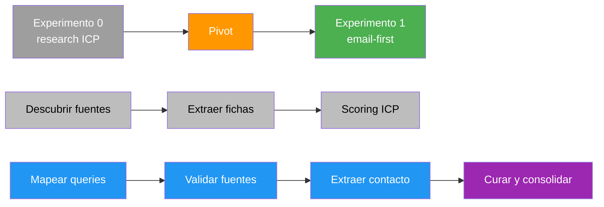

Antes buscábamos entender el mercado.

Ahora buscamos una salida operativa:
- nombre
- fuente
- geografia
- email o canal
- trazabilidad
- score de contactabilidad

---

## El flujo completo del Experimento 1

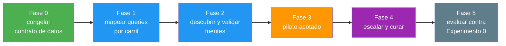

---

## Los tres carriles que probamos

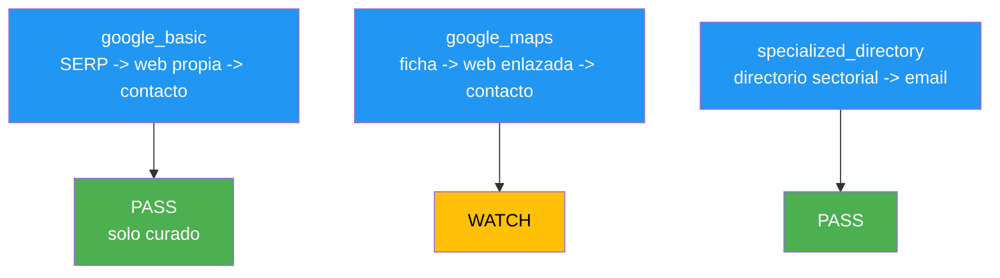

---

## Fase 1 — Mapping ICP-driven

No empezamos scrapeando. Primero convertimos el ICP en packs de busqueda.

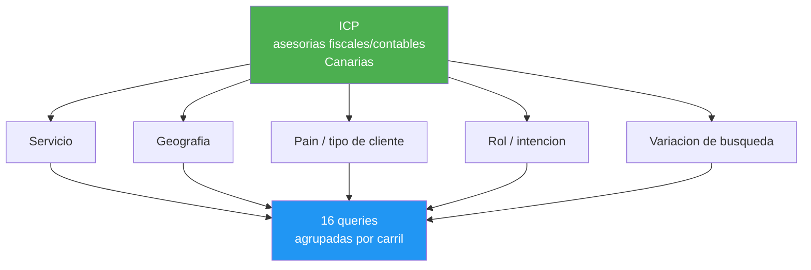

La idea era simple:
- no depender de un solo directorio
- forzar webs propias cuando fuese posible
- separar discovery, validacion local y directorios sectoriales

---

## Fase 2 — Validacion de fuentes

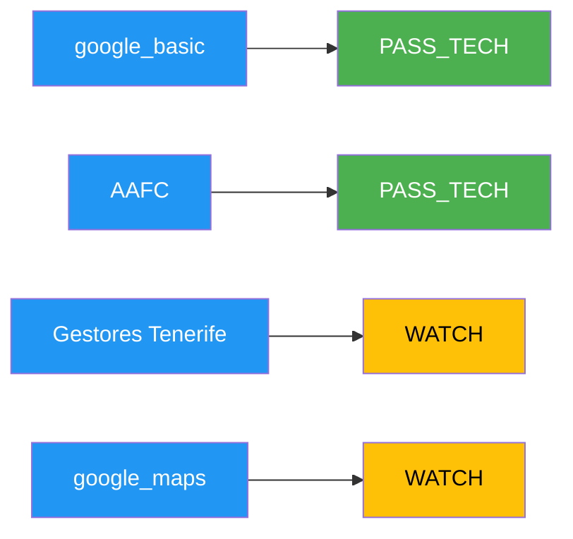

Lo importante aqui no era solo "la fuente existe".

Lo importante era:
- Scrapling puede entrar
- Scrapling puede extraer contacto
- la fuente sirve para emailing

---

## Fase 3 — Piloto

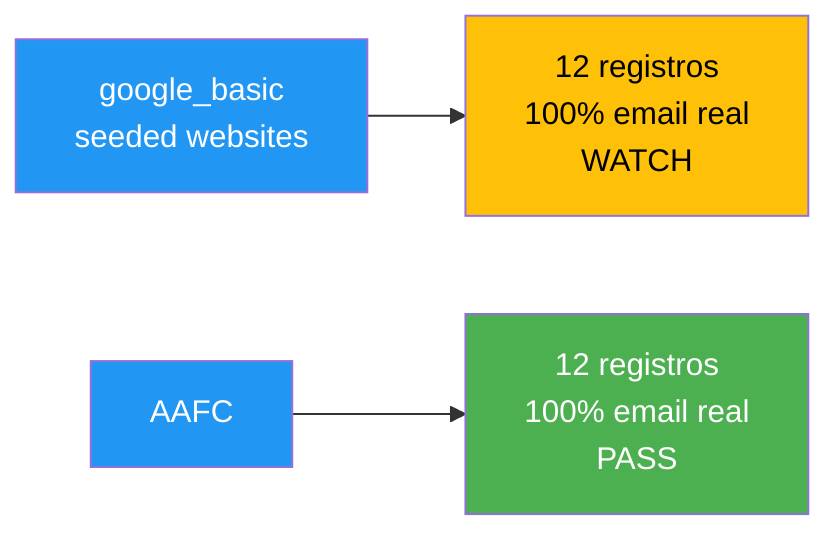

**Por que `google_basic` quedo en `WATCH` en el piloto?**

Porque en ese punto la extraccion de webs funcionaba, pero la discovery live en Google todavia devolvia `429 / sorry` con demasiada frecuencia.

---

## El rescate de `google_basic`

Esta fue la parte critica del experimento.

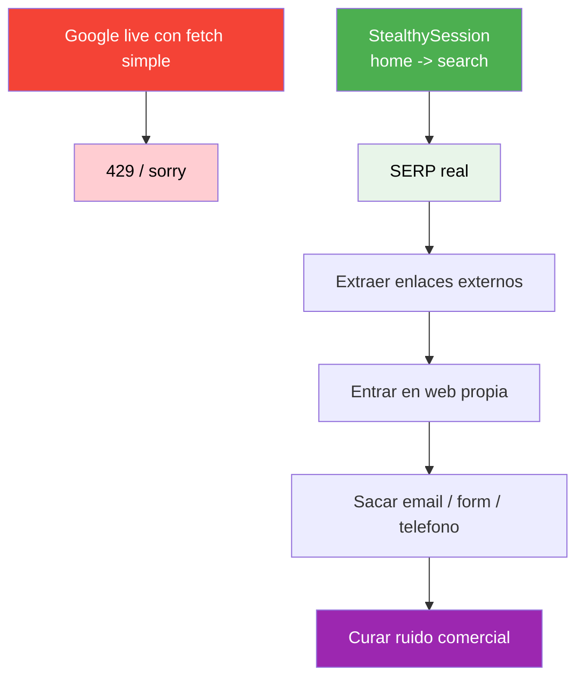

Lo que demostramos:
- Scrapling **si** puede hacer discovery live en Google
- pero el raw live no es suficiente
- Google mezcla webs propias con agregadores, institucional y ruido SEO

Por eso el output valido es:
- `google_basic raw live` para evidencia tecnica
- `google_basic curated` para operacion comercial

---

## Fase 4 — Escalado

### `AAFC`

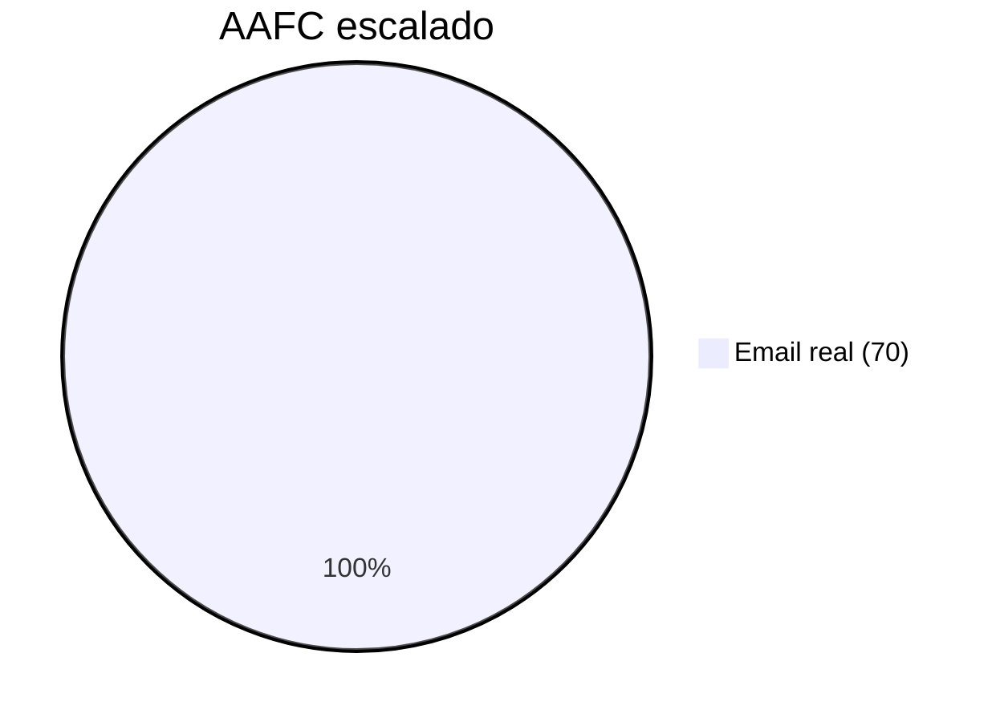

- `70` registros
- `100%` email real
- `0%` ruido
- `source_quality_score=95`

### `google_basic` curado

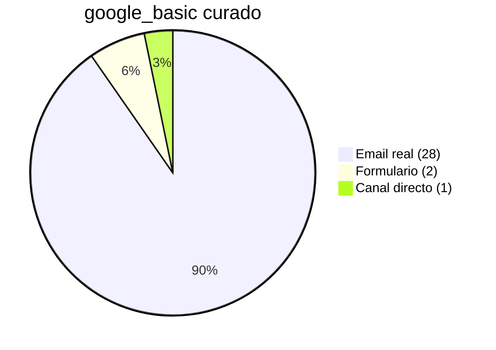

- `31` registros
- `90.3%` email real
- `0%` ruido
- `source_quality_score=95`

---

## El dataset final

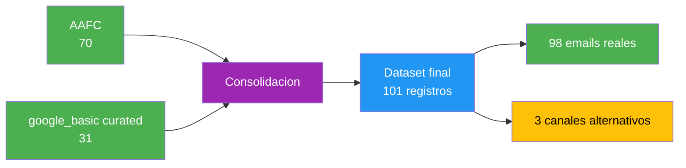

El dataset final ya permite:
- ordenar por `contactability_score`
- ordenar por `icp_score`
- saber de que fuente sale cada registro
- diferenciar email real de canal alternativo

---

## Comparacion con Experimento 0

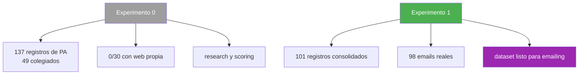

El cambio clave no es de volumen bruto.

El cambio clave es de valor:
- menos dependencia del directorio generalista
- mucho mas contacto util
- mejor trazabilidad
- mas capacidad de activacion

---

## Lo que validamos

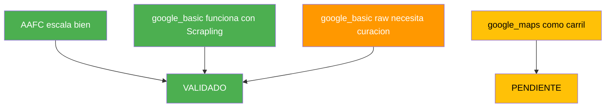

---

## Resumen para decidir

### Lo que ya podemos hacer

- escalar `AAFC`
- escalar `google_basic` en modo curado
- trabajar el dataset consolidado como base de emailing

### Lo que todavia no debemos hacer

- escalar `google_basic` raw sin filtro
- meter `google_maps` en produccion sin validacion especifica

---

## Que proponemos para el siguiente experimento

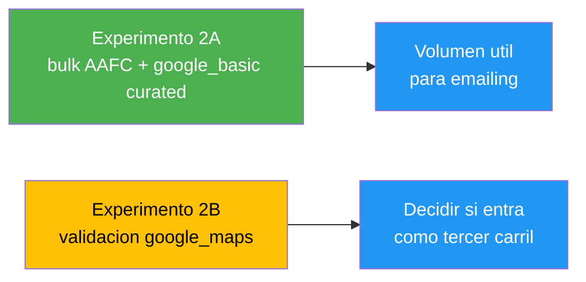

La prioridad correcta es:
1. explotar lo que ya funciona
2. validar despues lo que sigue incierto

Eso significa:
- primero `AAFC + google_basic curated`
- despues `google_maps`
